

 

 

 <h2 align=center style="margin: 1em 0; padding-bottom:1em;">L&K | landk</h2>

      
      
    

    

      
      
      
    

Language : [简体中文](./README.md) | English

## 🌐Introduction
## 📷screenshot
- #### Frontend
    - Login Page
    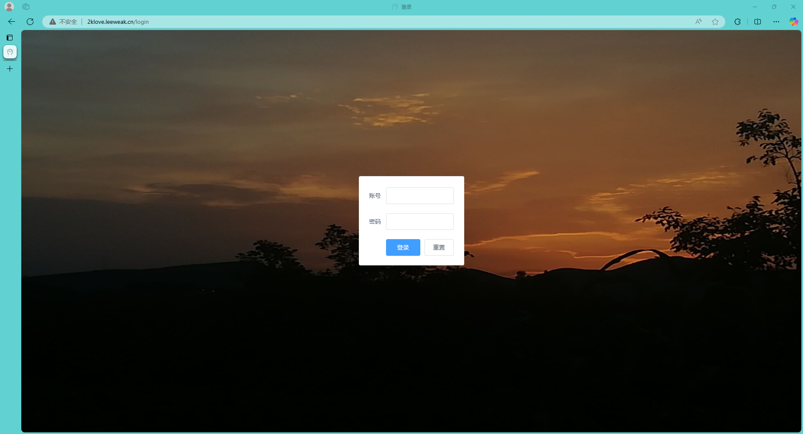
    - Home Page (Desktop)
    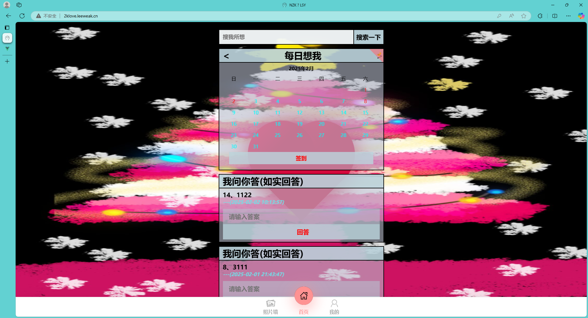
    - Home Page (Mobile)
    
    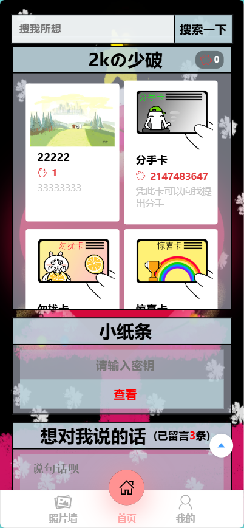
    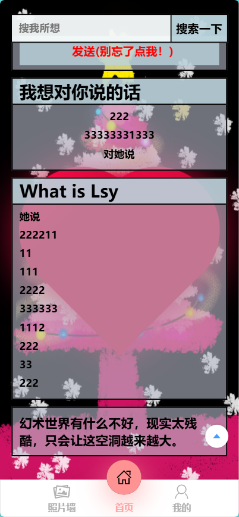
    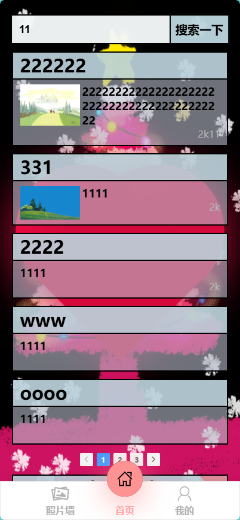
    - Profile
    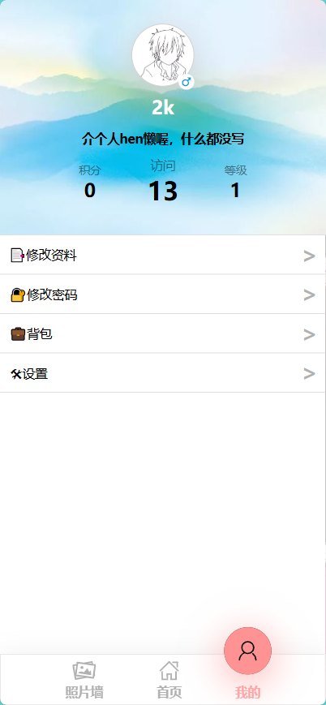
    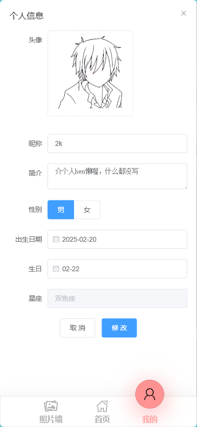
    - Photo Wall
    
    
    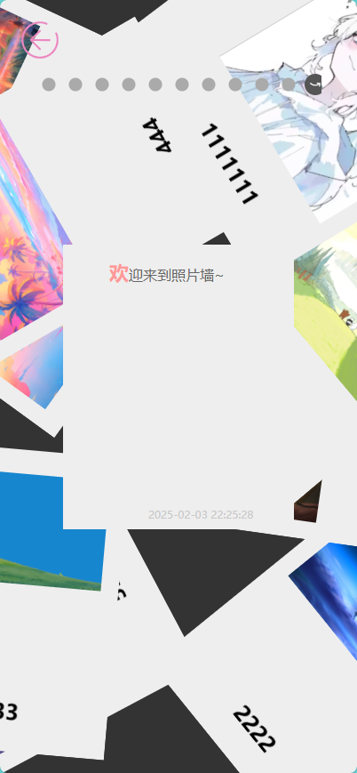
- #### Backend
    - Login Page
    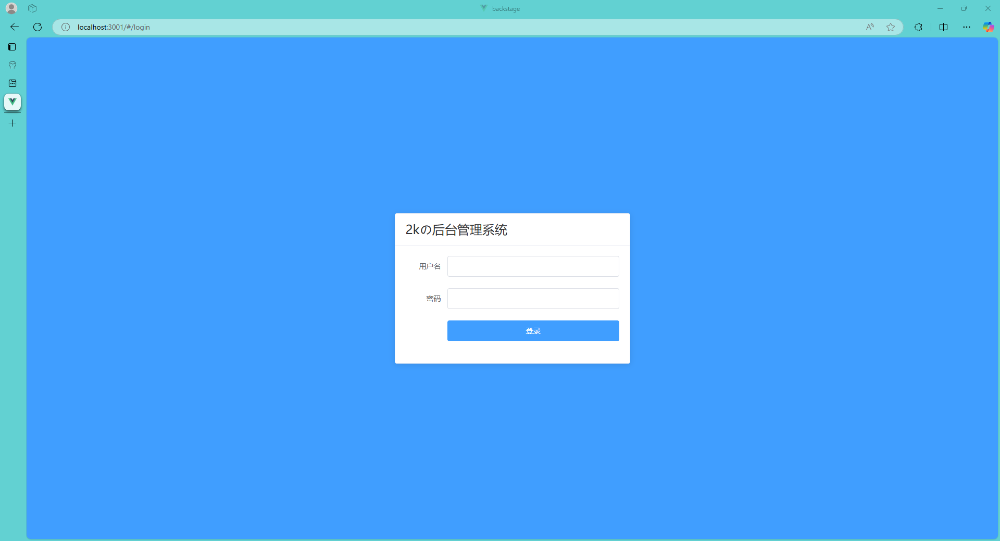
    - Home Page
    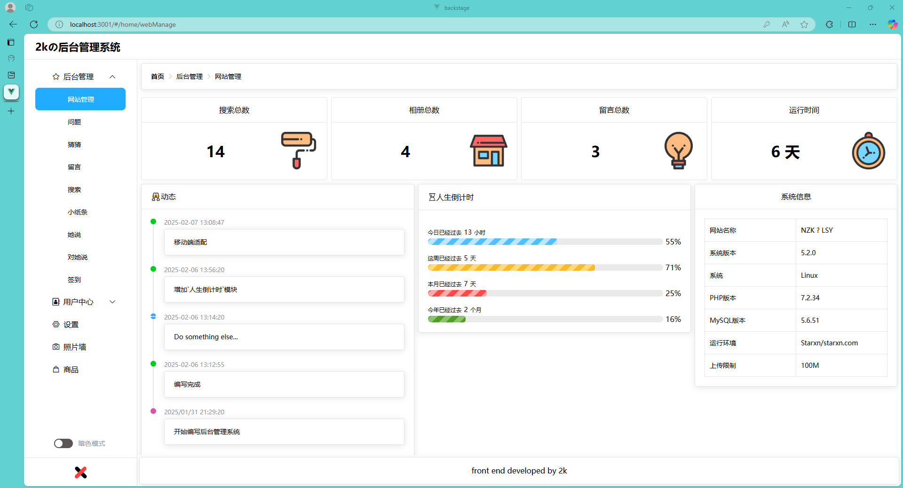
    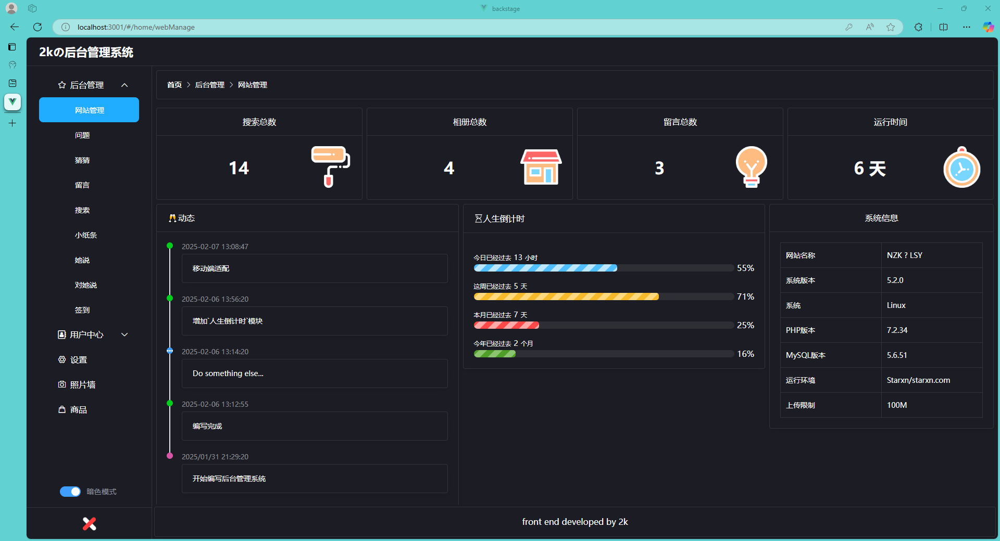
    
    - Data Management
    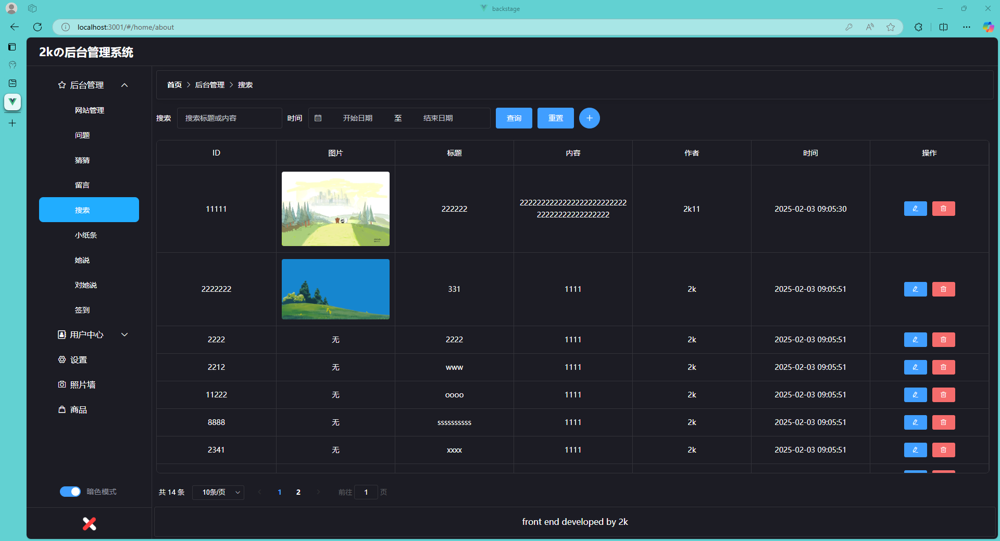
    
    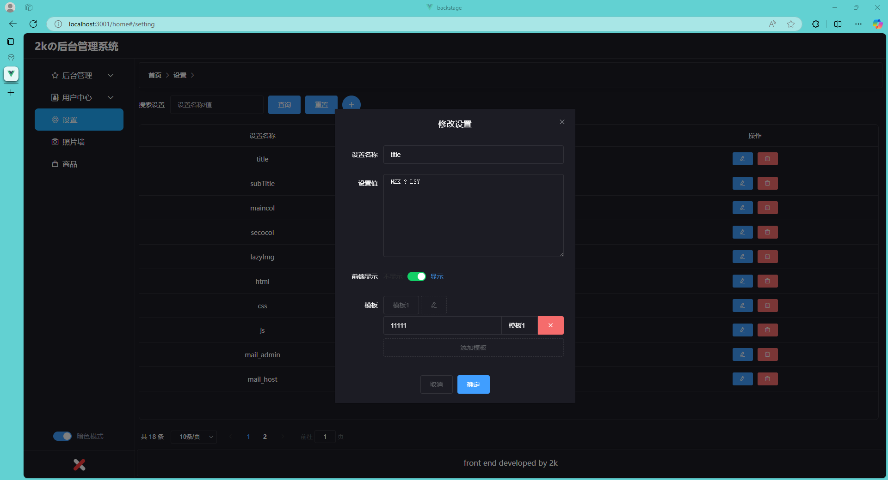
    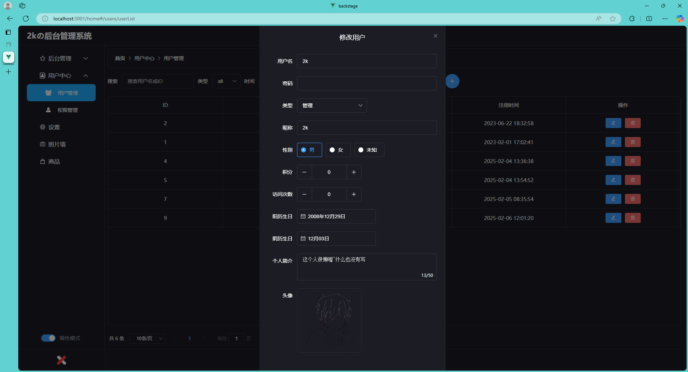

## ⏳ Start
I started this blog project to record our love, but we ended up breaking up.
## ✨ Development
#### 📦 Deploy
1.Prerequisites
- PHP 7.0.0+
- MySQL 5.0+

2.Configuration
- Clone the project to your local machine
- Create a database and import the SQL script
- Go to the `\config` folder and find the `database.php` configuration `username`, `password`
- Visit the website

## 🔧Tech Stack

Expand

| Category | Technology/Component  | Version       |
| ------------ | ----------------- | ------------ |
| Package Manager | npm            | 10.8.2       |
| Framework         | Vue.js             |       |
| **Main Framework**   | **ThinkPHP**| **5.1.41** |
| Database    | MySQL       | 5.6.51 |
| Operating Environment     | php         | 7.2.34 |
| Internationalization | -           | -      |

## 📦License

This project is licensed under the . For details, please refer to the LICENSE file.`GNU Affero General Public License v3.0`

We hope you enjoy using this project! If you have any questions, please feel free to contact us.
