

 

 

 <h2 align=center style="margin: 1em 0; padding-bottom:1em;">L&K | landk</h2>

      
      
    

    

      
      
      
    

语言 : 简体中文 | [English](./README.en.md)

## 项目介绍
## 📷项目截图
- #### 前台
    - 登录页
    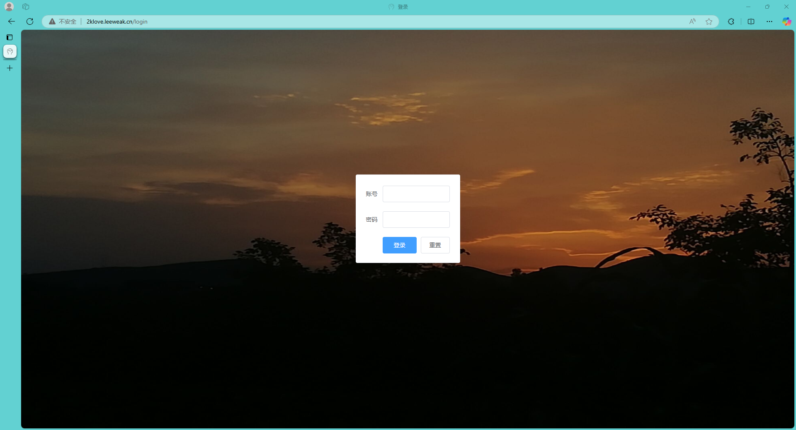
    - 主页(桌面端)
    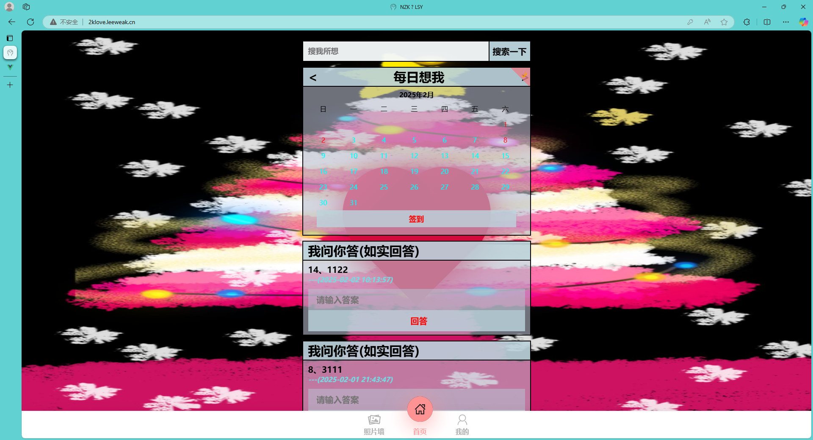
    - 主页(移动端)
    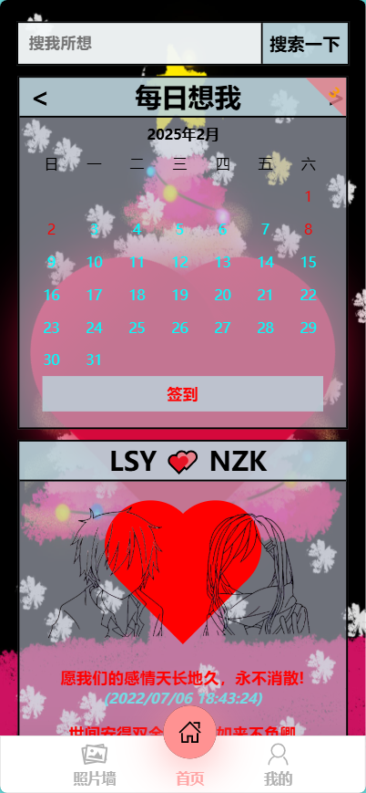
    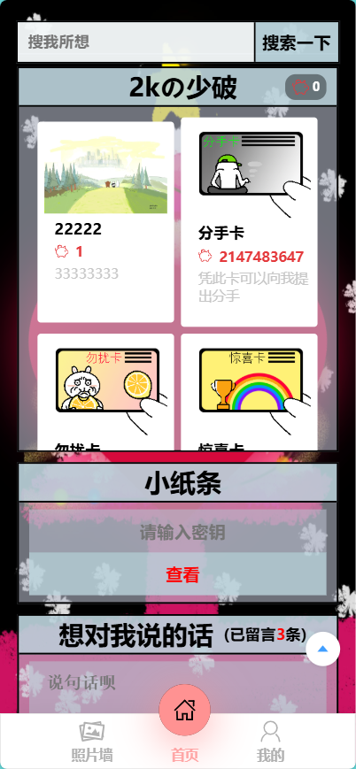
    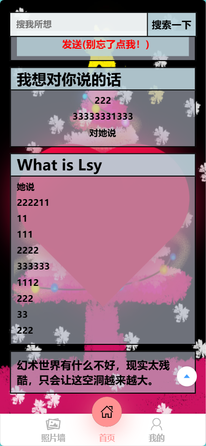
    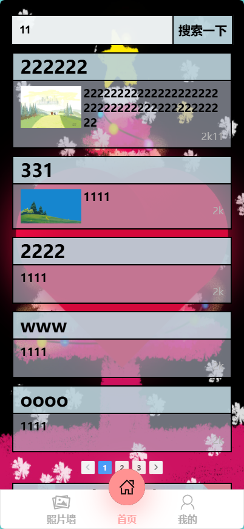
    - 我的
    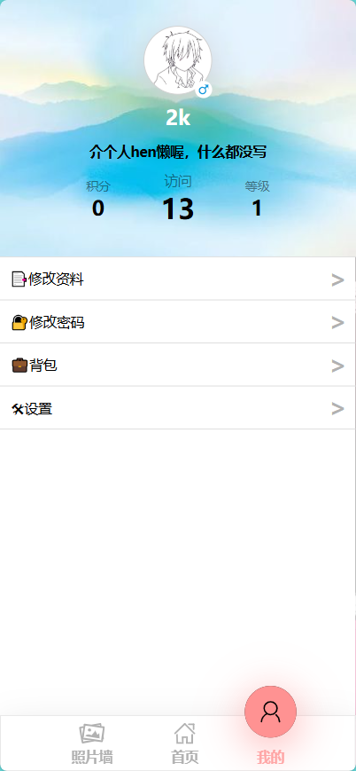
    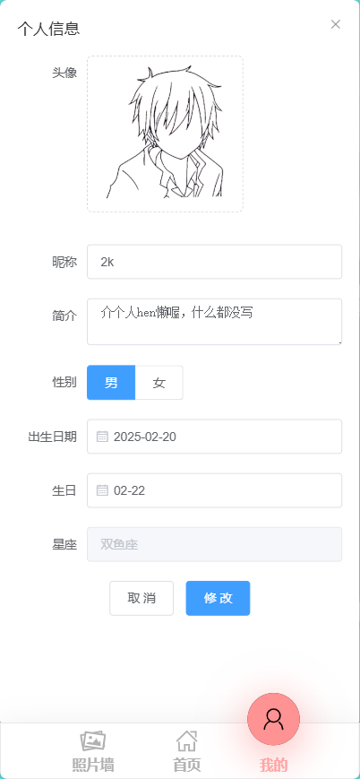
    - 照片墙
    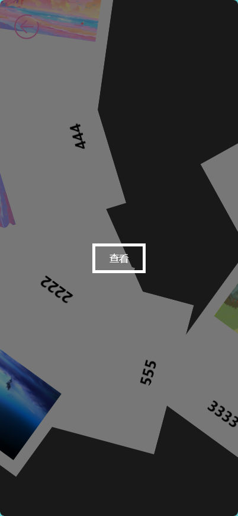
    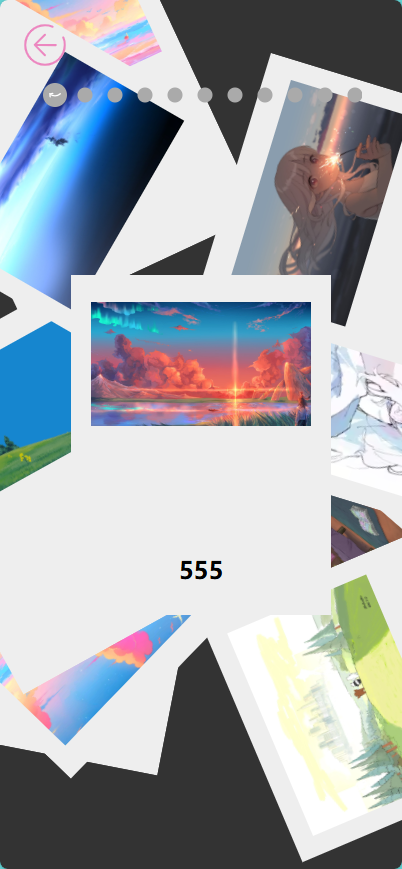
    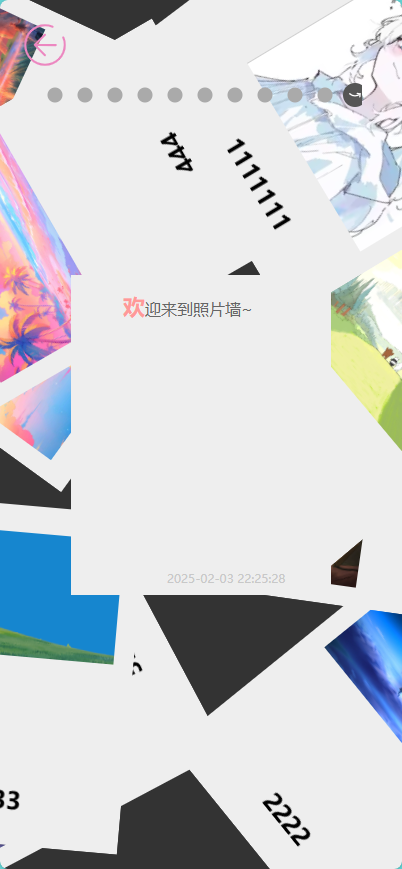
- #### 后台
    - 登录页
    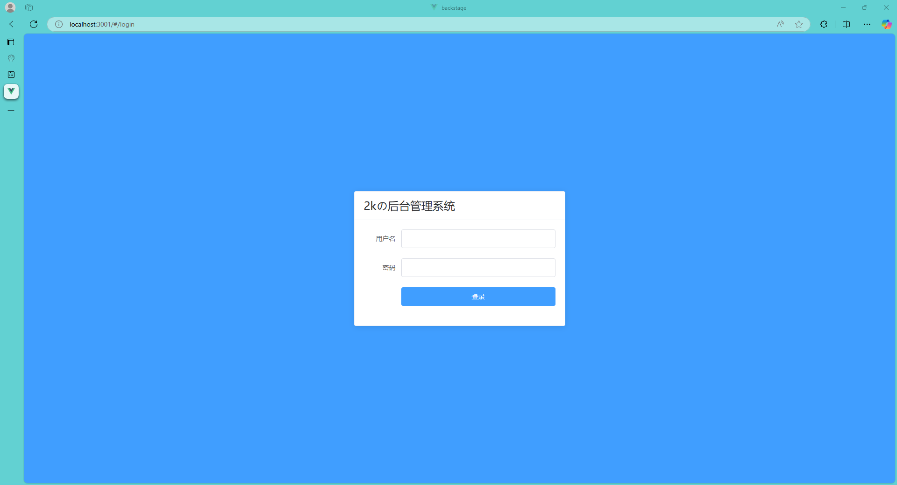
    - 主页
    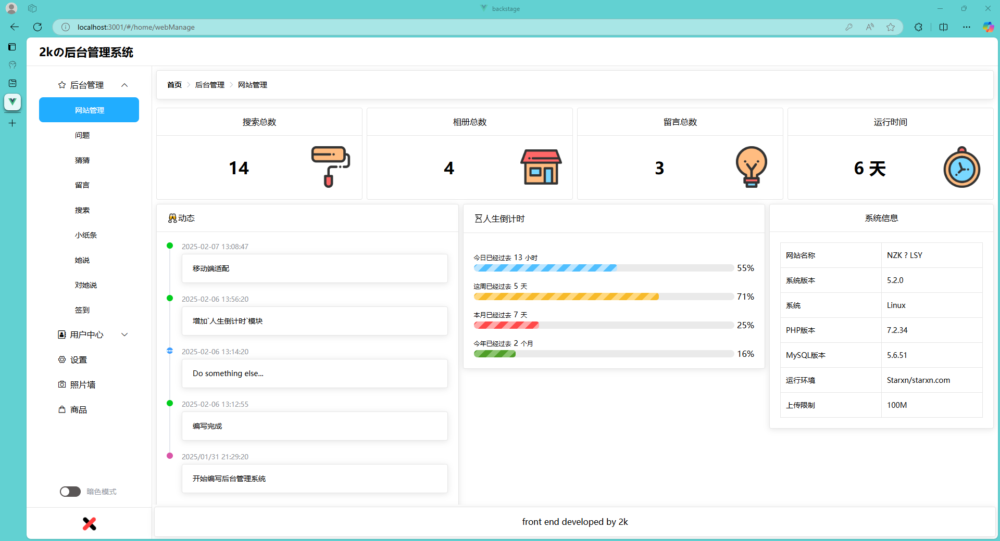
    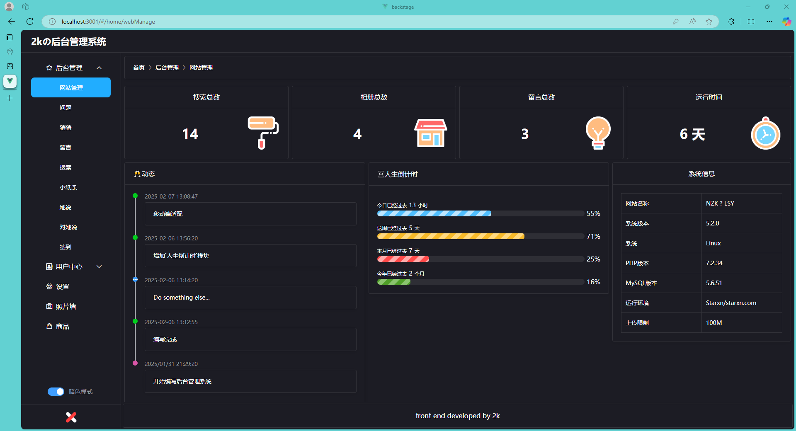
    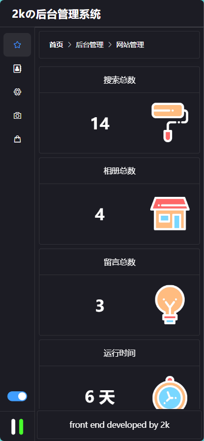
    - 数据管理
    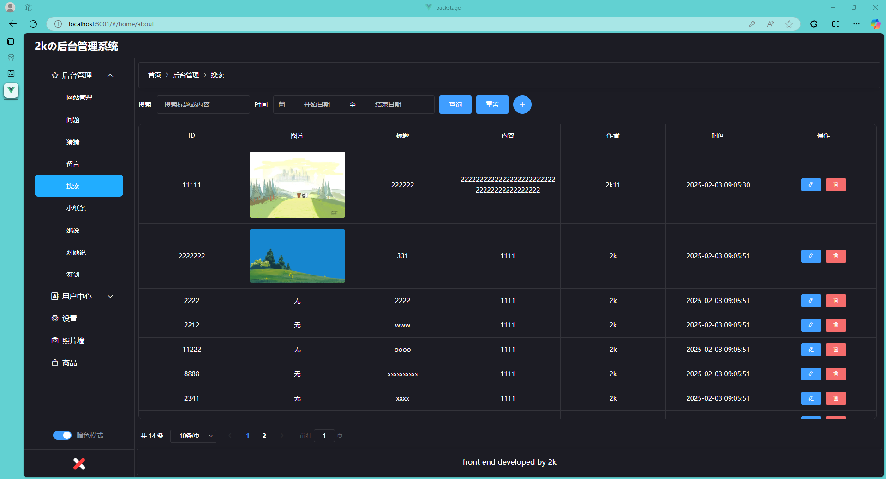
    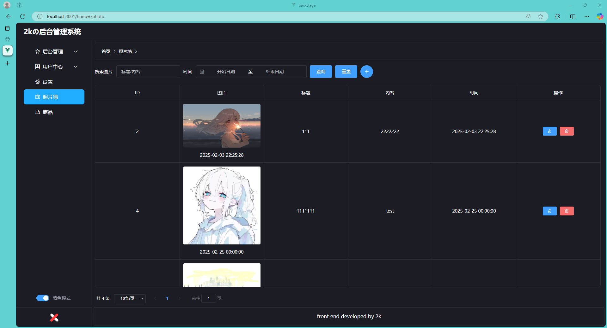
    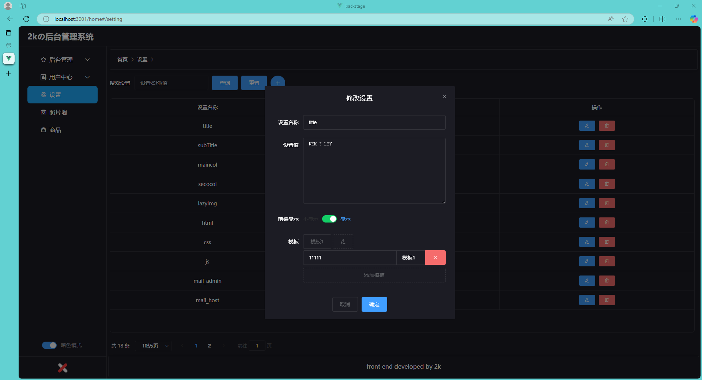
    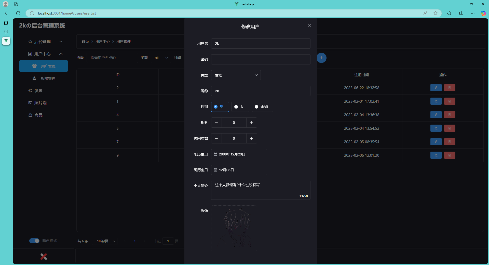

## ⏳ 起步
为了记录我们的爱情，我写了这个博客项目，但是最后还是分开了
## ✨ 开发
#### 📦 部署
1.前置环境
- PHP 7.0.0+
- MySQL 5.0+

2.配置
- 克隆项目到本地
- 创建数据库，导入SQL脚本
- 去到`\config`文件夹下找到`database.php`配置`数据库账户密码`
- 访问网站

## 🔧涉及技术栈 | Tech Stack

展开

| 类别         | 技术/组件          | 版本号       |
| ------------ | ----------------- | ------------ |
| 包管理器     | npm             | 10.8.2       |
| 框架         | Vue.js             |       |
| **主框架**   | **ThinkPHP**| **5.1.41** |
| 数据库       | MySQL       | 5.6.51 |
| 运行环境     | php         | 7.2.34 |
| 国际化       | -           | -      |

## 📦License

此项目遵循 ``GNU Affero General Public License v3.0`` 许可证，具体内容请查看 LICENSE 文件。

希望您在使用此项目时感到愉快！如有任何问题，请随时联系。
